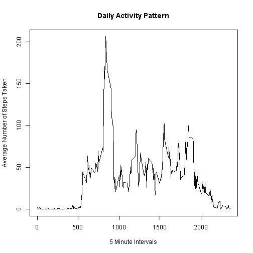

# Reproducible Research: Peer Assessment 1

## Loading and preprocessing the data

```r
data_path <-  ".//reproresdata//repdata-data-activity//"
df_act <- read.csv(paste(data_path,"activity.csv",sep="") )
df_act$date <- as.Date(df_act$date)
```

## What is mean total number of steps taken per day?

```r
totalstepsperday <- aggregate(df_act$steps,by=list(Date=df_act$date), sum, na.rm=TRUE)
```


```r
#Histogram of total steps taken each day
hist(totalstepsperday[,2], xlab="Total Steps Per Day",ylab="Frequency", main="Histogram of Total steps taken each Day", col="blue" , border="white")
```

 


```r
meanstepsperday <- mean(totalstepsperday[,2])
medianstepsperday <- median(totalstepsperday[,2])
print(paste("Mean total number of steps taken per day ",as.integer(meanstepsperday)))
```

```
## [1] "Mean total number of steps taken per day  9354"
```

```r
print(paste("Median total number of steps taken per day ",as.integer(medianstepsperday)))
```

```
## [1] "Median total number of steps taken per day  10395"
```

## What is the average daily activity pattern?

```r
avgactpattern <- aggregate(df_act$steps, by=list(MinInterval=df_act$interval), mean, na.rm=TRUE)
colnames(avgactpattern) <- c("MinInterval","AvgSteps")
```

```r
plot(x=avgactpattern[,1], y=avgactpattern[,2], type="l", xlab="5 Minute Intervals", ylab="Average Number of Steps Taken", main="Daily Activity Pattern")
```

 


```r
ordereredavgactpattern <- avgactpattern[order(avgactpattern$AvgSteps, decreasing=TRUE,na.last=TRUE),]
print(paste("The 5 minute interval with maximum number of steps is ",ordereredavgactpattern[1,1]))
```

```
## [1] "The 5 minute interval with maximum number of steps is  835"
```

## Inputting missing values

```r
#Calculate and report the total number of missing values in the dataset
nacnt <- is.na(df_act$steps)
bad <- df_act$steps[nacnt]
print(paste("Total number of missing values in the dataset ", length(bad)))
```

```
## [1] "Total number of missing values in the dataset  2304"
```

Strategy for filling in missing values is to use the mean for 5 minute interval averaged across all days.   


```r
#initialise data frame that will have missing values replaced from df_act
df_act_no_na <- df_act

#Fill in missing data
for(k in 1:nrow(df_act_no_na)) {
    if (is.na(df_act_no_na[k,1])){
        #find out mean steps for this interval
        intervaltoset <- df_act_no_na[k,3]
        
        for (i in 1:nrow(avgactpattern))
            if (avgactpattern[i,1]==intervaltoset) {
                ind <- i
                break
            }
        df_act_no_na[k,1] <- avgactpattern[ind,2] 
    }      
}
```
    

```r
totalstepsperdaynona <- aggregate(df_act_no_na$steps,by=list(Date=df_act_no_na$date), sum)

#Histogram of total number of steps taken each day after replacing missing values
hist(totalstepsperdaynona[,2], xlab="Total Steps Per Day",ylab="Frequency", main="Histogram of Total steps taken each Day after replacing NAs", col="purple" , border="white")
```

 


```r
#Calculate and report the mean and median total number of steps taken per day
meanstepsperdaynona <- mean(totalstepsperdaynona[,2])
medianstepsperdaynona <- median(totalstepsperdaynona[,2])
print(paste("Mean total number of steps taken per day with NAs removed ",as.integer(meanstepsperdaynona)))
```

```
## [1] "Mean total number of steps taken per day with NAs removed  10766"
```

```r
print(paste("Median total number of steps taken per day with NAs removed ",as.integer(medianstepsperdaynona)))
```

```
## [1] "Median total number of steps taken per day with NAs removed  10766"
```

Mean median steps taken per day calculated after replacing missing values with average number of steps per interval is GREATER than the mean and median total number of steps calculated without replacing missing values.   

## Are there differences in activity patterns between weekdays and weekends?

```r
#Create a new factor variable in the dataset with two levels -- "weekday" and "weekend" indicating whether a given date is a weekday or weekend day.
df_act_no_na$date <- as.Date(df_act_no_na$date)

#add factor variable indicating weekday or weekend
factorwkday <- factor(weekdays(df_act_no_na$date, abbreviate=TRUE))
levels(factorwkday) <- list("weekday"=c("Fri","Mon", "Thu","Tue","Wed"),"weekend"=c("Sat","Sun"))
#Add weekday indicator factor column to dataframe 
df_act_no_na <- cbind(df_act_no_na,factorwkday) 

avgstepswkdays <- aggregate(df_act_no_na$steps, by=list(Wkday=df_act_no_na$factorwkday,TimeInterval=df_act_no_na$interval), mean)
```


```r
#Make a panel plot containing a time series plot of the 5-minute interval (x-axis) and the average number of steps taken, averaged across all weekday days or weekend days (y-axis).
library(lattice)
xyplot(avgstepswkdays[,3]~avgstepswkdays$TimeInterval|avgstepswkdays$Wkday,layout=c(1,2),type="l",xlab="Time Interval", ylab="Average Number of Steps")
```

 

As the plot shows, amount of activity on weekdays is more than weekends. 
